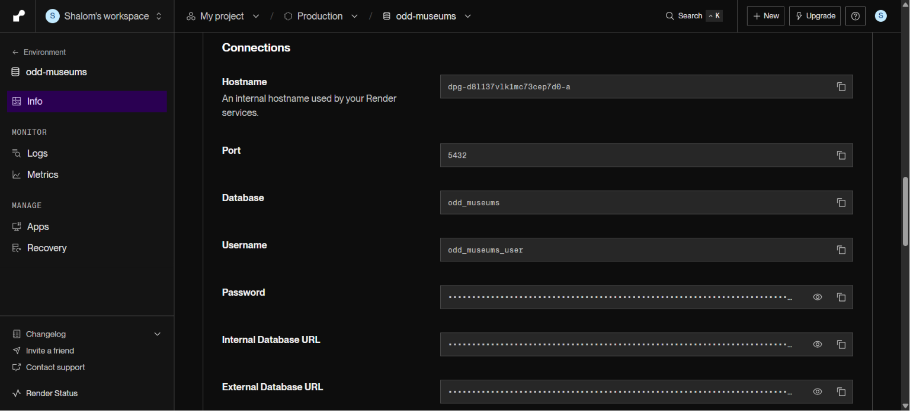
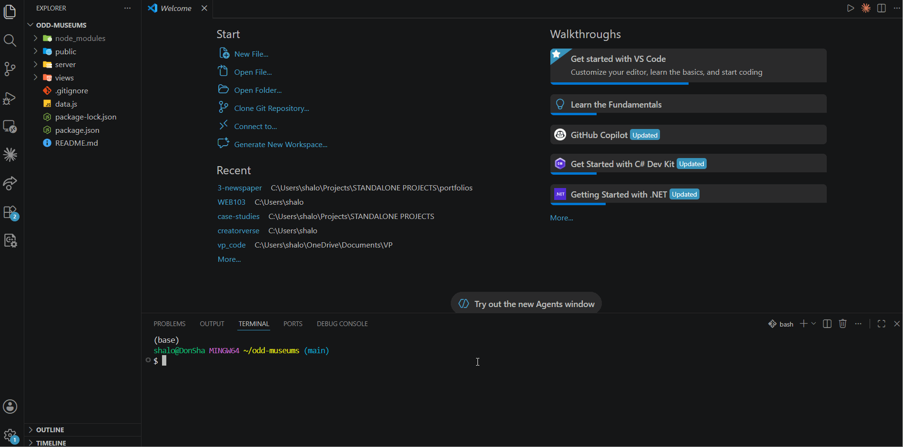

# WEB103 Project 2 - Odd Museums

Submitted by: **Shalom Donga**

About this web app: A listicle web app cataloguing seven spooky and unsettling museums from around the world. Built with Node.js and Express, with data served from a PostgreSQL database hosted on Render and a frontend built using only HTML, CSS, and JavaScript.

Time spent: **8** hours

## Required Features

The following **required** functionality is completed:

- [x] **The web app uses only HTML, CSS, and JavaScript without a frontend framework**
- [x] **The web app is connected to a PostgreSQL database, with an appropriately structured database table for the list items**
- [x] **Walkthrough added to the README, including a view of Render dashboard demonstrating that Postgres database is available**
- [x] **Walkthrough added to the README, must including a demonstration of table contents. Used the psql command 'SELECT * FROM tablename;' to display table contents.**

The following **optional** features are implemented:

- [ ] The user can search for items by a specific attribute

The following **additional** features are implemented:

- [ ] 

## Walkthrough

Here's a walkthrough of implemented required features:

GIF created with LiceCap.

## Notes

The Museums table includes seven entries spanning the Mutter Museum (Philadelphia), the Paris Catacombs, the Meguro Parasitological Museum (Tokyo), the Museum of Broken Relationships (Zagreb), Vent Haven Museum (Kentucky), the Capuchin Crypt (Rome), and the Sedlec Ossuary (Kutna Hora). Each entry carries a name, location, and curiosity level, with full details available on individual detail pages.

The backend follows the structure introduced in the UnEarthed lab: a config directory for the database connection and environment variables, a reset script to create and seed the gifts (museums) table, controllers for query logic, and routes connecting endpoints to those controllers. The frontend retrieves data from these routes rather than from a static data file.

## License

Copyright 2026 Shalom Donga

Licensed under the Apache License, Version 2.0 (the "License"); you may not use this file except in compliance with the License. You may obtain a copy of the License at

> http://www.apache.org/licenses/LICENSE-2.0

Unless required by applicable law or agreed to in writing, software distributed under the License is distributed on an "AS IS" BASIS, WITHOUT WARRANTIES OR CONDITIONS OF ANY KIND, either express or implied. See the License for the specific language governing permissions and limitations under the License.